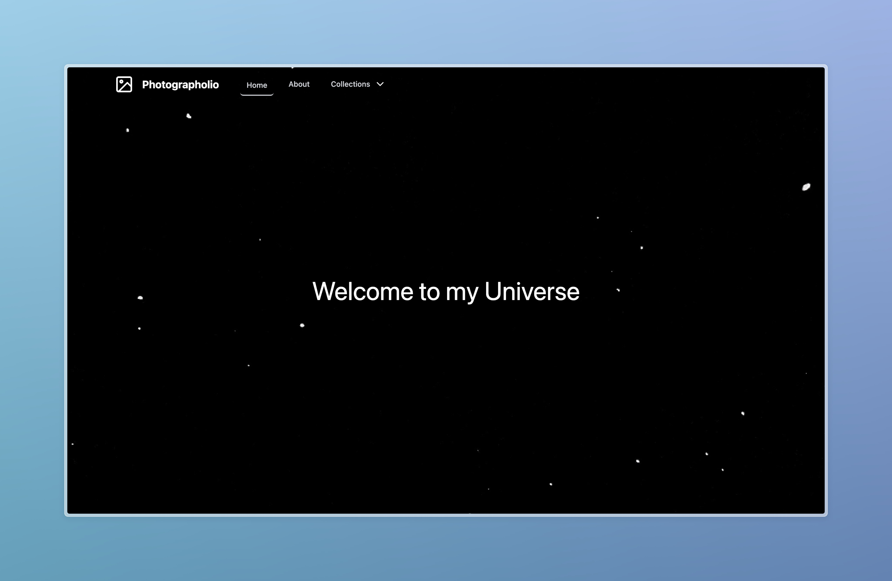

# Portfolio

> An elegant photography portfolio website built with Astro.

[](https://morgankryze.github.io/Portfolio/)

## Getting Started

### Prerequisites

- [Node.js](https://nodejs.org/en/)
- [pnpm](https://pnpm.io/)
- [Astro](https://astro.build/)
- [Tailwind CSS](https://docs.astro.build/en/guides/integrations-guide/tailwind/)
- [Svelte](https://docs.astro.build/en/guides/integrations-guide/svelte/)

### Installing

Start by downloading the project to your local machine or cloning it using Git:

```bash
git clone https://github.com/MorganKryze/Portfolio.git
```

Then, navigate to the project directory:

```bash
cd Portfolio/src/
```

### Build & Run

Run the following command:

```bash
pnpm run dev
```

### Deployment

To deploy the project, you can follow the instructions provided in the [Astro documentation](https://docs.astro.build/en/guides/deploy/github/).

## License

This project is licensed under the MIT License - see the [LICENSE.md](LICENSE.md) file for details

The photos in this project are not open source and are not included under the MIT license. They are the property of Yann M. Vidamment (MorganKryze) and may not be used without express written permission. Please contact Yann M. Vidamment (MorganKryze) at <morgan@kodelab.fr> for any inquiries about the photos.
